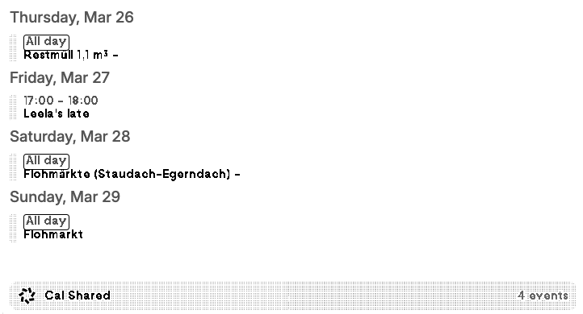

# TRMNL Home Assistant Calendar

A [larapaper](https://github.com/usetrmnl/larapaper) recipe that displays upcoming events from Home Assistant calendars on a TRMNL e-ink screen.



## How it works

```
TRMNL device  <--image--  Larapaper  --polls-->  Home Assistant REST API
                                                  GET /api/calendars/{entity}
```

Larapaper polls the HA calendar API on a schedule, stores the responses. No custom HA integration needed — just a long-lived access token.

## Installation

1. Download or clone this repository
2. ZIP the `src/` folder: `cd src && zip -r ../ha-calendar.zip . && cd ..`
3. In larapaper, go to **Plugins > Import** and upload `ha-calendar.zip`
4. Configure the plugin with your HA details

## Configuration

| Field | Description |
|---|---|
| **Home Assistant URL** | e.g. `http://192.168.1.100:8123` (no trailing slash) |
| **Long-Lived Access Token** | Created in HA under Profile > Long-Lived Access Tokens |
| **Calendar Entity IDs** | Comma-separated, e.g. `calendar.family,calendar.work` |
| **Days Ahead** | Number of days to show (1-30, default: 7) |
| **Timezone** | e.g. `Europe/Berlin`, `America/New_York` |

### Finding your calendar entity IDs

In Home Assistant, go to **Developer Tools > States** and filter for `calendar.` to see all available calendar entities.

Or call the API directly:
```
curl -H "Authorization: Bearer YOUR_TOKEN" http://YOUR_HA:8123/api/calendars
```

## Features

- Multiple calendar support (events merged and sorted)
- All-day events shown with "All day" badge
- Today/Tomorrow labels, weekday names for later days
- Physical locations shown (URLs hidden — not useful on e-ink)
- Responsive layouts for full, half, and quadrant sizes
- Plugin name used as title bar label

## Network requirements

Larapaper must be able to reach your HA instance. If both run on the same network (e.g. Docker on the same host), use the local IP. For remote access, use Tailscale, Cloudflare Tunnel, or similar.

## License

GPL-v3
